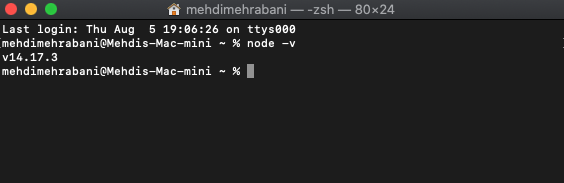
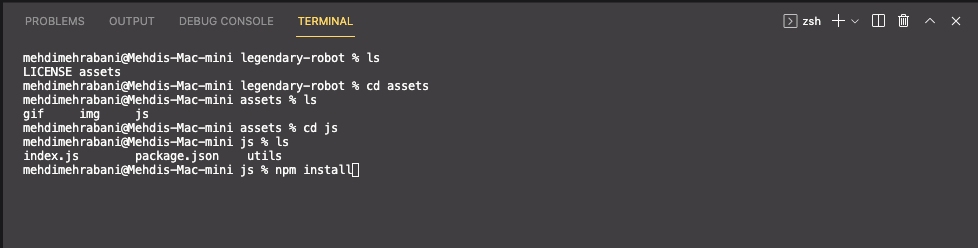
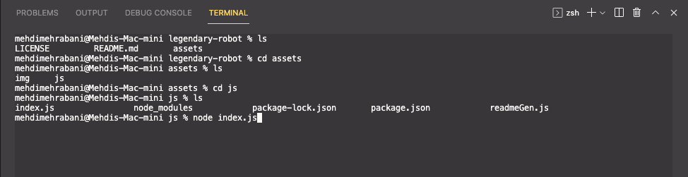

# legendary-robot

## Project Title: README Generator

## Table of Contents:

1. [Description](#description)
1. [Installation](#installation)
1. [Usage](#usage)
1. [Tips](#tips)
1. [Contributing](#contributing)
1. [Tests](#tests)
1. [License](#license)
1. [Questions](#questions)

## Description

This is a command-line application that runs with Node.js and dynamically generates a README file based on user answers.

## Installation

- Before cloning the repository, please ensure you have node.js installed as this is a command line application. If you do not have node.js installed, start with steps 1 and 2. If you have node.js installed and confirmed, you can skip steps 1 and 2 and begin on step 3.

  1.  Node.js Download Page

  2.  After install, check with command line to ensure setup is correct.

      a. Open your terminal

      b. type "node-v"

      c. If you see a version it means you have installed node.js correctly.

  

  3.  Clone repository and open in VS Code.

  4.  Open Terminal in VS Code

      a. Shortcut = CTRL + `

  5.  Navigate to the “js” folder in repo and install the npm "inquirer" package. See below image for guidance.

  

  6.  Once you hit enter, the correct dependencies for allowing you to use this application will be automatically installed. For more information, please check out the following [link](https://www.npmjs.com/package/inquirer).

## Usage

- Follow the below steps once you've completed the installation section guidelines.

  1.  Open Terminal in VS Code

      a. Shortcut = CTRL + `

  2.  Navigate to the “js” folder in repo. See below image for guidance.

  

  3.  Clone repository and open in VS Code. Once you hit enter, the application will begin to run and you will be prompted with a series of questions to answer.

### GIF Demo of README Generator

## Tips

### How To Create Markdown Lists

- If you are like me, using lists to write instructions is a must. As a result, I decided to write a short summary of how to incorporate lists using line breaks when answer the prompts.
- This entire README markdown was written using this method.

  - Line Break: { 0 }

  - Line Break + Indent Level 1: { 0 }{ 1 }

  - Line Break + Indent Level 2: { 0 }{ 2 }

- Explanation: When using the command line and you want to create a single line break, incorporate { 0 } at the beginning of the sentence where you want to have a line break.
- Please note, since I used this technique to write this document, I had to use extra space between the curly brackets and the numbers as to not trigger an indent. Therefore, when you do use this method just remove the extra space between the curly brackets and the numbers.

VS Code Preview

- One efficiency tips when writing README files was utilizing VS Codes preview markdown feature. This feature allows you to preview how your markdown files before having to upload to see the final output.

  - Shortcut To Preview: CMD + Shift + V

  - For more information, please check out the following [link](https://code.visualstudio.com/docs/languages/markdown)

## Contributing

Sharing is caring so feel free to share your bugs or update ideas by opening a Github Issue. I’ll try to respond as soon as I can. See below image for where to find the Issue page.

## Tests

There are no tests at the moment.

## License

<a href="https://choosealicense.com/licenses/mit" target="_blank">MIT License</a>

## Questions

Github Portfolio Link: [Mehdi Mehrabani](https://github.com/mmehr1988) 
Email Contact: tatash.my@gmail.com
